# ✍️ Arabic Handwriting Recognition from Scratch (NumPy MLP)

[](https://www.python.org/)
[](https://numpy.org/)
[](https://matplotlib.org/)
[](https://github.com/Hadisovic/arabic-handwriting-nn-scratch)
[](https://github.com/Hadisovic/arabic-handwriting-nn-scratch)

A comprehensive, production-ready implementation of a **Multi-Layer Perceptron (MLP) Neural Network built entirely from scratch using NumPy**. This project recognisies hand-written Arabic characters from **Task 7: Arabic Letters Group 4** (`ا، ب، ت، ث، ج، ح، خ، د، ذ، ر`). It is a full Year 3 Neural Networks course project featuring custom stroke-preserving data augmentation, performance diagnostics, and a thorough hyperparameter sensitivity analysis across 5 core experiments.

---

## 🌟 Features & Highlights
* **Zero Deep Learning Frameworks**: Built using pure Python and `numpy` (no PyTorch, TensorFlow, or Keras) to demonstrate clean mathematical derivations of neural network mechanics.
* **Disjoint Data Splitting (No Leakage)**: Original drawings are strictly split into 80% training and 20% test subsets *before* any data augmentation, ensuring that the test set consists entirely of unseen original drawings with zero data leakage.
* **Advanced Stroke-Preserving Augmentation**: Implements an in-memory pipeline performing random scaling (85% to 115%), horizontal shear slant ($\pm0.12$), rotation ($\pm12^\circ$), translation ($\pm2.0$ px), and stroke thickness variation via Gaussian blur and Gamma/contrast scaling.
* **He (Kaiming) Weight Initialization**: Dynamically initializes parameters using He initialization (scaled by $\sqrt{2.0/N}$), which is mathematically optimal for preventing vanishing or exploding gradients in ReLU activation layers.
* **Performance Diagnostics & Early Stopping**: Employs a score-based checkpointing mechanism tracking the *Generalization Score* (defined as $\text{Test Acc} - 0.5 \times \max(0, \text{Generalization Gap} - 4\%)$) and implements early stopping with patience to prevent overfitting.
* **Hyperparameter Sensitivity Experiments**: Out-of-the-box scripts to benchmark and compare learning rates, batch sizes, model capacity (hidden neurons), dropout & $L_2$ regularization, and random seeds.

---

## 📂 Codebase Walkthrough

Here is a breakdown of the files included in this repository:

* 📄 **[main.py](file:///d:/Uni/Year3/Sem2/Nueral_Networks/NN_Project%20%28Final%29/main.py)**: The main entry point. Coordinates dataset loading, runs the 5 sensitivity experiments, executes a grid search for L2 and dropout regularisation, saves the best weights, and generates the final confusion matrix and history plots.
* 📄 **[train.py](file:///d:/Uni/Year3/Sem2/Nueral_Networks/NN_Project%20%28Final%29/train.py)**: The engine of the MLP. Contains standard feedforward/backpropagation passes, parameter updates, ReLU/Softmax/Cross-Entropy calculations, early stopping, and training configurations with regularization (dropout + L2).
* 📄 **[experiments.py](file:///d:/Uni/Year3/Sem2/Nueral_Networks/NN_Project%20%28Final%29/experiments.py)**: Defines and executes the 5 required hyperparameter sensitivity experiments and triggers comparison plotting functions.
* 📄 **[data_loader.py](file:///d:/Uni/Year3/Sem2/Nueral_Networks/NN_Project%20%28Final%29/data_loader.py)**: Manages loading and preprocessing 28x28 grayscale images. Includes the stroke-preserving handwriting augmentation engine.
* 📄 **[visualize.py](file:///d:/Uni/Year3/Sem2/Nueral_Networks/NN_Project%20%28Final%29/visualize.py)**: Custom plotting helper scripts using Matplotlib to draw loss comparison curves, generalization gap subplots, and confusion matrices.
* 📄 **[classify.py](file:///d:/Uni/Year3/Sem2/Nueral_Networks/NN_Project%20%28Final%29/classify.py)**: A standalone CLI interface to run real-time predictions on custom hand-drawn character images using saved model weights (`best_model_weights.npz`).
* 📄 **[THE Report.html](file:///d:/Uni/Year3/Sem2/Nueral_Networks/NN_Project%20%28Final%29/THE%20Report.html)**: The academic final technical report documenting project details, experimental data, mathematical derivations, and conclusions.

---

## 📐 Network Architecture & Mathematical Derivations

The network consists of a single hidden layer feedforward architecture:
$$\text{Input } (784 \text{ Neurons}) \longrightarrow \text{Hidden } (64 \text{ Neurons, ReLU}) \longrightarrow \text{Output } (10 \text{ Neurons, Softmax})$$

### 1. Forward Propagation
For a batch of input $X \in \mathbb{R}^{m \times 784}$:
$$Z_1 = X W_1 + b_1$$
$$A_1 = \max(0, Z_1) \quad (\text{ReLU})$$
$$Z_2 = A_1 W_2 + b_2$$
$$A_2 = \text{Softmax}(Z_2)$$

To prevent numerical overflow when computing Softmax:
$$\text{Softmax}(Z)_{i} = \frac{e^{Z_i - \max(Z)}}{\sum_{j} e^{Z_j - \max(Z)}}$$

### 2. Loss Function (Cross-Entropy with L2 regularization)
$$L = -\frac{1}{m} \sum_{i=1}^{m} \sum_{j=1}^{C} Y_{ij} \ln(\text{clip}(A_{2,ij}, 10^{-12}, 1-10^{-12})) + \frac{\lambda}{2m} (\|W_1\|_F^2 + \|W_2\|_F^2)$$

### 3. Backpropagation Gradients (Chain Rule Derivation)
Using the matrix form chain rule:
$$dZ_2 = A_2 - Y$$
$$dW_2 = \frac{1}{m} A_1^T dZ_2 + \frac{\lambda}{m} W_2$$
$$db_2 = \frac{1}{m} \sum_{\text{rows}} dZ_2$$
$$dA_1 = dZ_2 W_2^T$$
$$dZ_1 = dA_1 \odot \mathbb{I}(Z_1 > 0) \quad (\text{where } \mathbb{I} \text{ is the indicator/ReLU derivative})$$
$$dW_1 = \frac{1}{m} X^T dZ_1 + \frac{\lambda}{m} W_1$$
$$db_1 = \frac{1}{m} \sum_{\text{rows}} dZ_1$$

---

## 📊 Dataset Classes

The dataset targets the following 10 classes from **Task 7**:

| Class Index | Arabic Letter | Transliteration | Folder Name |
| :---: | :---: | :---: | :---: |
| **0** | ا | Alaf | `class0_Alaf` |
| **1** | ب | Ba | `class1_ba` |
| **2** | ت | Taa | `class2_taa` |
| **3** | ث | Tha | `class3_tha` |
| **4** | ج | Jeem | `class4_jeem` |
| **5** | ح | Haa | `class5_haa` |
| **6** | خ | Kha | `class6_kha` |
| **7** | د | Dal | `class7_dal` |
| **8** | ذ | Thal | `class8_thal` |
| **9** | ر | Raa | `class9_raa` |

---

## 📈 Experimental Benchmarks

Below is a consolidated summary of the performance monitoring across the 5 sensitivity experiments:

| Experiment | Configuration | Train Accuracy | Test Accuracy | Gen. Gap | Early Stop | Diagnosis Flag |
| :--- | :--- | :---: | :---: | :---: | :---: | :---: |
| **Exp 1: Learning Rate** | LR = 0.1 <br> **LR = 0.01 (Default)** <br> LR = 0.001 | 100.00% <br> **95.68%** <br> 80.32% | 95.00% <br> **95.00%** <br> 84.00% | 5.00% <br> **0.68%** <br> -3.68% | 52 / 200 <br> **65 / 200** <br> 142 / 200 | Slight Overfit <br> **Good Fit** <br> Good Fit |
| **Exp 2: Batch Size** | Batch = 8 <br> **Batch = 16 (Default)** <br> Batch = 32 | 99.38% <br> **95.68%** <br> 92.52% | 96.00% <br> **95.00%** <br> 91.00% | 3.38% <br> **0.68%** <br> 1.52% | 74 / 200 <br> **65 / 200** <br> 99 / 200 | **Good Fit** <br> **Good Fit** <br> Good Fit |
| **Exp 3: Hidden Neurons** | H = 16 <br> H = 32 <br> **H = 64 (Default)** <br> H = 128 | 89.02% <br> 94.65% <br> **95.68%** <br> 97.63% | 88.00% <br> 91.00% <br> **95.00%** <br> 96.00% | 1.02% <br> 3.65% <br> **0.68%** <br> 1.63% | 73 / 200 <br> 70 / 200 <br> **65 / 200** <br> 86 / 200 | Good Fit <br> Good Fit <br> **Good Fit** <br> Good Fit |
| **Exp 4: Regularization** | No Regularization <br> Dropout = 0.2 <br> L2 = 0.01 <br> **Dropout + L2** | 95.68% <br> 96.82% <br> 97.93% <br> **96.28%** | 95.00% <br> 96.00% <br> 97.00% <br> **95.00%** | 0.68% <br> 0.82% <br> 0.93% <br> **1.28%** | 65 / 200 <br> 117 / 200 <br> 123 / 200 <br> **122 / 200** | Good Fit <br> Good Fit <br> Good Fit <br> **Good Fit** |
| **Exp 5: Initialization** | **Seed = 42 (Default)** <br> Seed = 123 <br> Seed = 7 | **95.68%** <br> 97.63% <br> 93.63% | **95.00%** <br> 92.00% <br> 93.00% | **0.68%** <br> 5.63% <br> 0.63% | **65 / 200** <br> 93 / 200 <br> 55 / 200 | **Good Fit** <br> Slight Overfit <br> Good Fit |

---

## 🎨 Visualization Gallery

All experimental charts and confusion matrices are generated dynamically in the `plots/` folder during execution:

### 🏆 Best Model Training & Confusion Matrix
Below are the accuracy/loss curves and class confusion matrix for the **Best Fit Regularized Model** (`dropout=0.3, L2=0.0`):

| Training History Curves | Confusion Matrix |
| :---: | :---: |
| 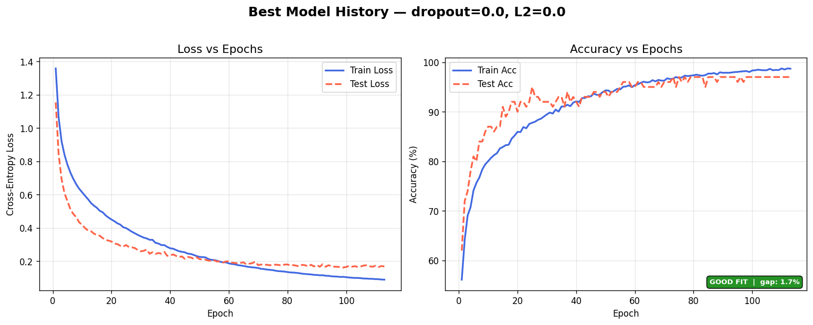 | 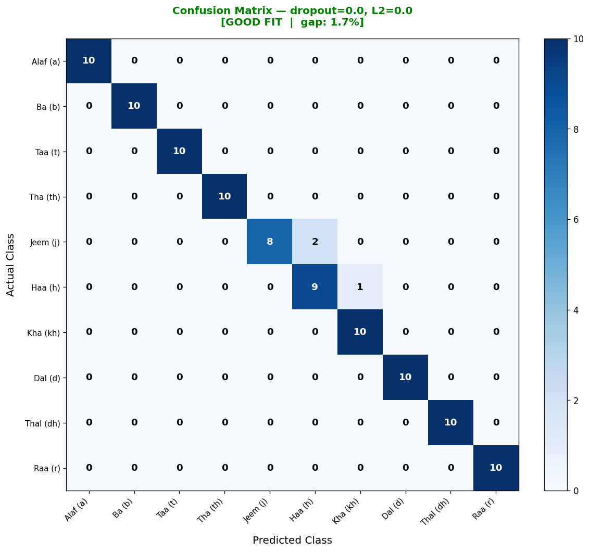 |

---

### 🔬 Experiment Analysis Dashboard

#### 1. Learning Rate Sensitivity (Exp 1)
| Loss / Accuracy Comparison | Generalization Gap Curve |
| :---: | :---: |
| 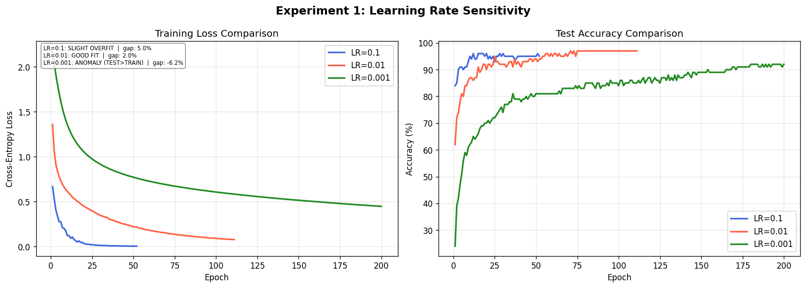 | 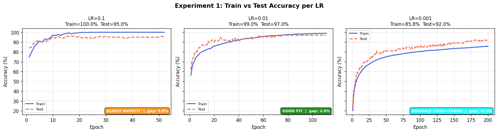 |

#### 2. Batch Size Effect (Exp 2)
| Loss / Accuracy Comparison | Generalization Gap Curve |
| :---: | :---: |
| 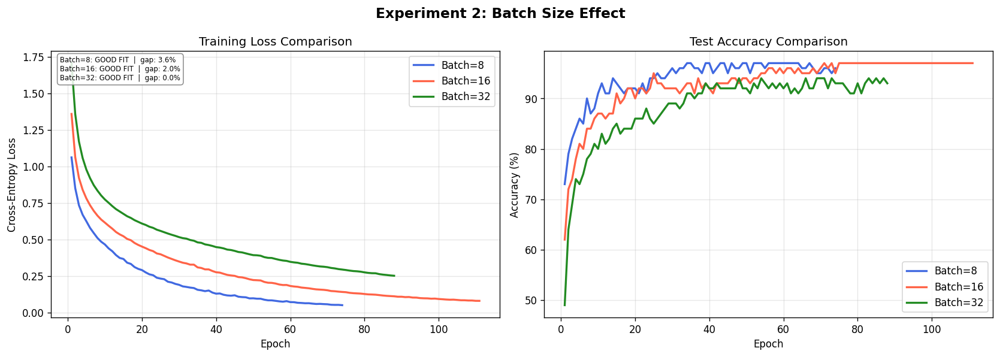 | 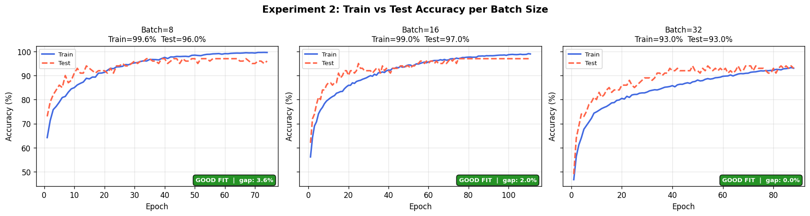 |

#### 3. Model Capacity / Hidden Size (Exp 3)
| Loss / Accuracy Comparison | Generalization Gap Curve |
| :---: | :---: |
| 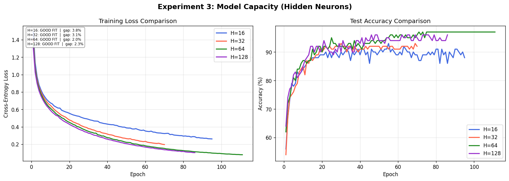 | 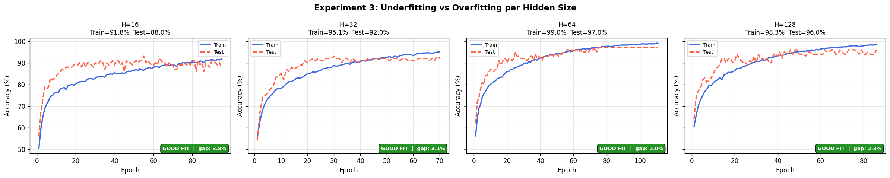 |

#### 4. Regularization Impact (Exp 4)
| Loss / Accuracy Comparison | Generalization Gap Curve |
| :---: | :---: |
| 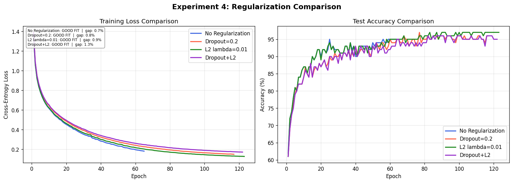 | 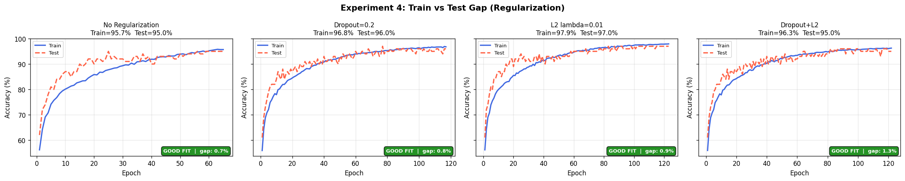 |

#### 5. Weight Initialization Sensitivity (Exp 5)
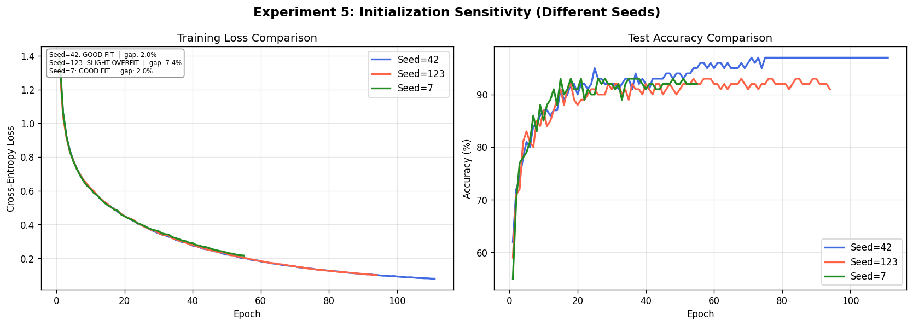

---

## 🚀 Getting Started

### 📦 Prerequisites & Installation
Ensure you have Python 3.8+ installed on your system.

1. Clone this repository to your local machine:
   ```bash
   git clone https://github.com/Hadisovic/arabic-handwriting-nn-scratch.git
   cd arabic-handwriting-nn-scratch
   ```

2. Install the necessary dependencies (NumPy, Matplotlib, and Pillow for image processing):
   ```bash
   pip install numpy matplotlib pillow
   ```

### ⚡ Running Training & Experiments
To train the best-fit model and automatically run all 5 experiments, simply execute the main script:
```bash
python main.py
```
This script will:
1. Load the original dataset from `dataset_backup/` and execute disjoint train/test splits.
2. Run the 5 hyperparameter benchmark experiments.
3. Perform a grid search to find the optimal dropout and L2 settings.
4. Output comparison charts and confusion matrices to the `plots/` folder.
5. Save the trained model parameters to `best_model_weights.npz`.

---

## 🔍 Inferences & Classifying Custom Images

After running the training script, you can classify any handwritten character image using the standalone utility `classify.py`:

```bash
python classify.py path/to/your_image.png
```

### Example Classification Output:
```text
Loading trained weights from 'best_model_weights.npz'...
Preprocessing custom image 'dataset_backup/class0_Alaf/img_001.png'...

==================================================
CLASSIFICATION RESULT
==================================================
  Predicted Letter : ا (Alaf)
  Confidence Score : 99.42%
==================================================

Full Class Confidence Probabilities:
--------------------------------------------------
  Class 0 ا (Alaf ):  99.42% | ███████████████████
  Class 1 ب (Ba   ):   0.14% | 
  Class 2 ت (Taa  ):   0.08% | 
  Class 3 ث (Tha  ):   0.02% | 
  Class 4 ج (Jeem ):   0.05% | 
  Class 5 ح (Haa  ):   0.11% | 
  Class 6 خ (Kha  ):   0.04% | 
  Class 7 د (Dal  ):   0.06% | 
  Class 8 ذ (Thal ):   0.03% | 
  Class 9 ر (Raa  ):   0.05% |
--------------------------------------------------
```

---

## 👥 Authors & Academic Credits

This project was developed for the **Neural Networks** course.

| # | Student Name | Student ID |
| :---: | :--- | :---: |
| 1 | **AbdulHadi Achkar** | 202220181 |
| 2 | **Yousef Safori** | 202310875 |
| 3 | **Saif Hasan** | 202310810 |

---
*Developed as part of academic coursework for Year 3 Semester 2.*
